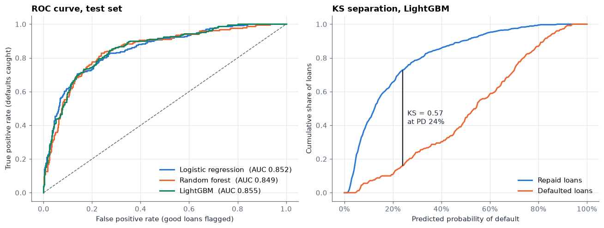
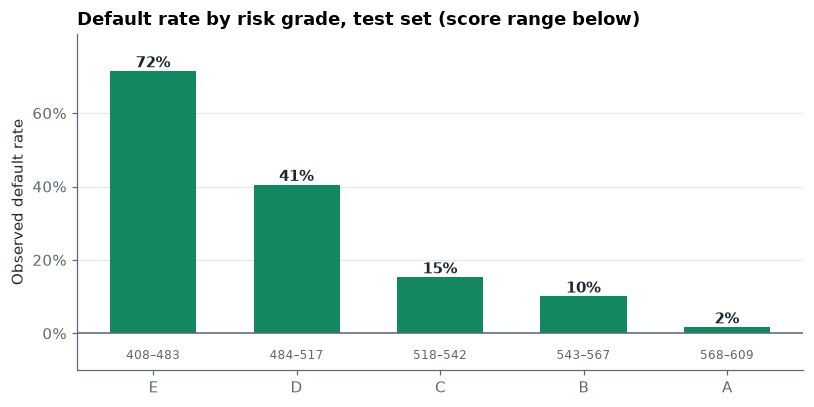
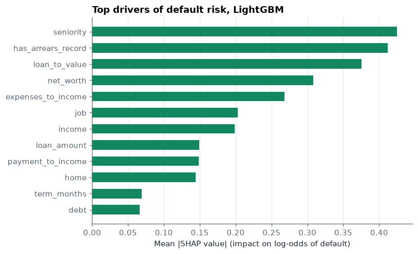

# Credit Risk Model: Predicting Loan Default

Predicts the probability that a loan applicant will default (PD), turns it into a lending decision that maximizes expected profit, and converts it into a points-based credit score with risk grades A–E.



## Results (held-out test set, 891 loans)

| Model | ROC-AUC | Gini | KS | Brier |
|---|---|---|---|---|
| Logistic regression | 0.852 | 0.704 | 0.566 | 0.132 |
| Random forest | 0.849 | 0.698 | 0.591 | 0.136 |
| **LightGBM** | **0.855** | **0.710** | 0.573 | 0.132 |

**Lending policy comparison** (assumes 60% loss given default and a 15% net margin on good loans):

| Policy | Approval rate | Default rate of approved loans | Profit |
|---|---|---|---|
| Approve everyone | 100% | 28.2% | −79,773 |
| Reject anyone with an arrears record | 83% | 21.8% | −18,563 |
| **LightGBM: approve if PD < 18%** | 47% | 5.9% | **+37,717** |

**Credit score grades** (600 points = 50:1 odds of repaying, 20 points to double the odds):

| Grade | Score range | Observed default rate |
|---|---|---|
| A | 568–609 | 1.7% |
| B | 543–567 | 10.1% |
| C | 518–542 | 15.3% |
| D | 484–517 | 40.5% |
| E | 408–483 | 71.5% |



## What the notebook does

1. **Cleans the raw data:** decodes numeric category codes and replaces the `99999999` missing-value marker.
2. **Explores who defaults:** arrears history, job type, housing, income, age.
3. **Adds credit ratios:** loan-to-value, payment-to-income, expenses-to-income, net worth.
4. **Trains three models:** logistic regression (the regulated-industry standard), random forest, and a grid-searched LightGBM, all compared with 5-fold cross-validation.
5. **Evaluates them with credit-risk metrics:** ROC-AUC, Gini, KS statistic, PR-AUC, Brier score and calibration.
6. **Picks the approval cut-off that maximizes expected profit.** It is chosen on out-of-fold training predictions and checked once on the test set.
7. **Explains the model with SHAP.** The top drivers are years with the current employer, previous arrears, loan-to-value, net worth and expenses-to-income.
8. **Builds a scorecard:** PD is mapped to a points-based score and A–E grades. A `score_applicant()` function scores a new application end to end.



## Data

[CreditScoring](https://github.com/gastonstat/CreditScoring): 4,455 consumer loan applications from a Spanish bank, 28% of which defaulted. A copy is in `data/credit_scoring.csv`.

## Run it

```bash
pip install -r requirements.txt
jupyter notebook credit_risk_model.ipynb
```

## Limitations and next steps

- The loss-given-default and margin figures are illustrative. A lender would use its own pricing and recovery data, and the cut-off would move with them.
- The dataset is small and historical. A production model would need monitoring for population drift (PSI) and periodic recalibration.
- Fairness across age and marital status should be tested before any real-world use.
